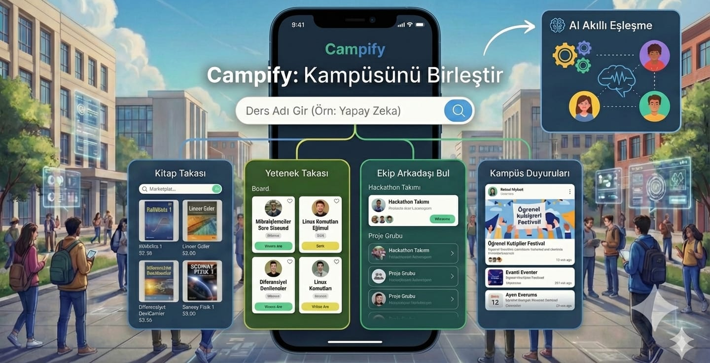

# CAMPIFY

---

## Proje Hakkında

**Proje Tanımı:** 
*Campify*, üniversite ekosistemindeki akademik ve sosyal süreçleri tek bir entegre platform altında toplayan, yapay zeka destekli bir dijital kampüs çözümüdür. Dağınık ve verimsiz ilerleyen öğrenci etkileşimlerini merkezi bir yapıya dönüştürerek; ders materyali alışverişinden yetenek eşleştirmeye, proje ekip oluşturma süreçlerinden kampüs içi iletişime kadar tüm ihtiyaçları veri odaklı algoritmalarla optimize eder. Akademik profiller ve ilgi alanları üzerinden çalışan akıllı eşleştirme sistemi sayesinde doğru kişileri doğru fırsatlarla buluşturarak kampüs içi verimliliği artırır, iş birliğini güçlendirir ve üniversiteler için ölçeklenebilir bir dijital ekosistem altyapısı sunar

**Proje Kategorisi:** 
Sosyal Medya 

---

## Proje Linkleri

- **REST API Adresi:** 
- **Web Frontend Adresi:** 

---

## Proje Ekibi

**Grup Adı:** 
CAMPIFY

**Ekip Üyeleri:** 
- Marya Salimi
- Sinem Havan
- Emine Türkoğlu
- Melisa Öztaş

---

## Dokümantasyon

Proje dokümantasyonuna aşağıdaki linklerden erişebilirsiniz:

1. [Gereksinim Analizi](Gereksinim-Analizi.md)
2. [REST API Tasarımı](API-Tasarimi.md)
3. [REST API](Rest-API.md)
4. [Web Front-End](WebFrontEnd.md)
5. [Mobil Front-End](MobilFrontEnd.md)
6. [Mobil Backend](MobilBackEnd.md)
7. [Video Sunum](Sunum.md)

---
